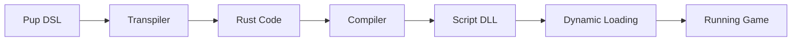

# 🐕 Perro Game Engine

**Perro** is an experimental, open-source game engine written in **Rust**, designed
as a modern alternative to engines like Godot and Unity.  

It focuses on **performance, flexibility, and developer freedom**, while introducing
unique ideas that make game development faster and more enjoyable:

- ⚡ **Managed Runtime** – no Rust installation required. Just download Perro and start making games.  
- 🐶 **Pup DSL** – a lightweight scripting language that compiles to Rust, giving you native performance with a clean, approachable syntax.  
- 🎨 **FUR (Flexible UI Rules)** – a declarative UI system inspired by XAML/JSX, with Tailwind-style utility classes for styling.  
- 🛠 **Rust-first core** – safe, fast, and modern systems programming under the hood, but hidden from game developers.  

---

## 👩‍💻 For Game Developers

Game developers never need to install Rust or manage compilers.  
Perro provides a **managed runtime** that handles everything automatically.  

### Quick Start

1. **Download Perro**  
   Grab the Perro Manager to download your preferred version of the editor!
   
3. **Open the Editor**  
   Run `Perro.exe` (or the platform equivalent).  
   - You’ll see the **Project Manager**.  
   - Create or open a project to start editing.

4. **Make a Game**  
   - Write gameplay in **Pup DSL**.  
   - Design UI with **FUR**.  
   - Hit **Play** in the editor — Perro automatically:
     - Transpiles Pup → Rust
     - Compiles Rust → DLL
     - Hotloads the DLL into the running game

👉 **You never need Rust installed.** The editor and runtime handle everything for you.

---

## 🐶 Pup DSL

**Pup** is Perro’s scripting language.  
It is designed to be concise and readable, while compiling directly into **Rust** for native performance.  

- Familiar, high-level syntax  
- Compiles to Rust, then to a native DLL  
- Hot-reload support for instant iteration  
- Safe by design, leveraging Rust’s guarantees  

### Example

```pup
extends Sprite2D
    let speed = 7.5

    fn init() {
        print("Player is ready!")
    }

    fn update(delta: float) {
        if input.is_key_down("Left") {
          self.position.x -= speed * delta
        }
        if input.is_key_down("Right") {
          self.position.x += speed * delta
        }
    }
```

---

## 🎨 FUR (Flexible UI Rules)

**FUR** is Perro’s declarative UI system, inspired by XAML and JSX, with styling conventions similar to Tailwind.  

- Attributes use `=` for values  
- Spaces in names are replaced with `-`  
- Styles are composable and utility-driven  

### Example

```fur
[UI]
    [Panel style="bg=sea-5 padding=4"]
        [Text style="font-weight=bold text-color=white text-size=xl"]
          Hello Perro!
        [/Text]
    [/Panel]
[/UI]
```

---

## ⚡ Fast Iteration

Perro is designed for **rapid iteration**:

- On modern desktops: **sub-second compile + hotload times**  
- On lower-end hardware: typically **1–2 seconds**  

This means you can tweak Pup scripts or FUR layouts and see results almost instantly.

---

## 🔧 How It Works



- **Pup DSL** → Gameplay code  
- **Transpiler** → Converts Pup into Rust  
- **Compiler** → Rust compiles into a DLL  
- **Core** → The engine/editor hotloads the DLL  
- **Game** → Runs with native Rust performance  

---

## 🛠 For Engine Contributors

If you want to work on **Perro itself** (not just make games with it), you’ll need:

- [Rust (GNU toolchain preferred)](https://www.rust-lang.org/)  
- Cargo  

### Contributor Workflow

- **Runtime**  
  `perro_runtime` is the launcher used when building from source.  
  - With no arguments → opens the editor  
  - With a project path → runs that project directly as a game  

- **Core**  
  The editor and engine logic live in `perro_core`. To rebuild the editor's scripts:

  ```bash
  cargo run -p perro_core
  ```

- **Running a Project (from source)**  

  ```bash
  cargo run -p perro_runtime ./examples/hello_world
  ```

---

## 🛠 Roadmap

- [x] Core engine loop  
- [x] FUR MVP (UI files referenced in scene files)  
- [x] Pup DSL transpiler (basic)  
- [ ] Complete Pup transpiler + full Rust API coverage  
- [ ] Pup API polish  
- [ ] Scene editor (dogfooding in progress)  
- [ ] Asset pipeline
- [ ] Plugin System as self contained Rust crates
- [ ] Additional language support (C#, TypeScript, etc...)  

---

## 🤝 Contributing

Contributions are welcome!  
If you’d like to help shape Perro, check out the [CONTRIBUTING.md](CONTRIBUTING.md) and join the discussions.

---

## 📜 License

Perro is licensed under the **Apache 2.0 License**.  
See [LICENSE](LICENSE) for details.

---

## 🐾 Why "Perro"?

Because every good game dev needs a loyal engine companion, and in Spanish, **Perro** means **Dog** 🐕
