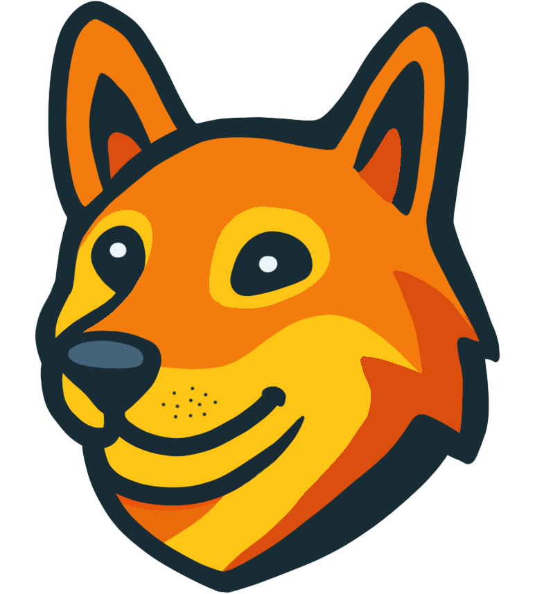

# 🐕 Perro Game Engine

  

**Perro** is an experimental, open-source game engine written in **Rust**, built as a modern alternative to engines like Unreal, Godot, and Unity. It focuses on **performance**, **flexibility**, and **direct control**: scripts transpile to Rust (no VM), assets and scenes can be statically embedded in release builds, and the runtime is designed so that an **eventual standalone editor** can ship as a single binary without dragging in a heavy toolchain for end users.

**Version: 0.1.0 prerelease.** There is no editor yet — this repo is the engine core, dev runtime, and scripting pipeline. Contributions and experimentation are welcome; see [Contributing](#-contributing) and [CONTRIBUTING.md](CONTRIBUTING.md).

---

## Why Perro exists

The engine exists to give you **native performance and Rust’s safety** without writing the whole game in Rust by hand. Scripts (Pup, and experimentally TypeScript/C#) are **transpiled to Rust** and compiled with the Rust toolchain — no interpreter, no VM, no marshalling layer. In release, scripts and static assets (scenes, UI, textures, meshes etc.) are embedded into one final executable. The design also targets a **standalone editor** later: one binary that can open projects, run them, and export them, without requiring every user to install Visual Studio or the MSVC toolchain. That’s why we standardize on the **GNU toolchain** (see below): so the future editor and the engine share one consistent toolchain and the shipped product stays portable.

---

## Why the GNU toolchain

The **eventual editor will be a standalone application** — a single binary that users download and run. To get there without tying the ecosystem to Windows-specific tooling (e.g. MSVC), Perro uses the **GNU toolchain** (`x86_64-pc-windows-gnu` on Windows, and the default toolchain on Linux/macOS). That way:

- The editor binary and the engine are built with the same toolchain story.
- User projects compile with that same story; we don’t mix MSVC and GNU in the pipeline.
- We avoid forcing end users to install Visual Studio or MSVC build tools just to use the editor.

So if you’re building or contributing on Windows, use the GNU toolchain (e.g. `rustup default stable-x86_64-pc-windows-gnu`). Linux/macOS use the default toolchain. Exact version and setup are in [CONTRIBUTING.md](CONTRIBUTING.md).

---

## Engine overview

- **Core** — `perro_core` holds the engine: scene graph, nodes, rendering (e.g. wgpu), input, and the scripting API that generated code calls into. No game logic lives in the core; it’s all in scripts (transpiled to Rust) or in the dev/editor binaries that host the core.
- **Transpile, don’t interpret** — The transpiler and codegen live in the engine (`perro_core`, scripting). PUP (and experimental TypeScript/C#) are parsed and **transpiled to Rust**; the generated Rust is written under **`.perro/scripts/src` inside each game project** That subcrate is built either as a **DLL** (dev: load at runtime, fast script iteration) or **statically linked** into the game binary, the `.perro/project` subcrate (release: one executable, no script files). The runtime never executes PUP/TS/C# directly; it always runs the compiled Rust. To inspect the generated code, look in a project’s `.perro/scripts/src`. See [docs/ENGINE.md](docs/ENGINE.md) for dev vs release, static assets, and the `.perro` layout.
- **Scenes & UI** — Scenes are described in `.scn` files; UI is written in **FUR** (Flexible UI Rules), a declarative format. In release, these are compiled into Rust data (e.g. `static_assets`) and embedded so the binary doesn’t read `.scn`/`.fur` at runtime. In dev, they’re loaded from disk for iteration. See [docs/SCENES.md](docs/SCENES.md) and the docs index in [docs/README.md](docs/README.md).
- **Signals** — A global, name-based signal system that allows full decoupling of emitters and listeners, emit in place A and connect in place B, your function will fire!

The **docs/** folder has engine architecture, transpiler, scripting APIs (including [PUP](docs/PUP.md)), and language guides.

---

## Repository layout (brief)

| Path | Purpose |
|------|---------|
| **perro_core/** | Engine: scene graph, rendering, nodes, scripting API, transpiler, FUR. |
| **perro_dev/** | Dev-time binary: loads script DLL, runs a project from `--path`. |
| **perro_editor/** | Editor “game” project (future standalone editor will derive from this). |
| **playground/** | Playground for trying things and testing stuff. |
| **unit_tests/transpiler_test/** | Compiler test suite. `--path --test --scripts` (or `--path --test --dev`) runs this: it checks that scripts transpile and the generated Rust compiles. Shorthand: `--test`; long form: `--test_transpiler`. |
| **docs/** | Engine overview, PUP reference, scenes, transpiler, language docs. |

Building and running a project from the repo is described in the docs and in [CONTRIBUTING.md](CONTRIBUTING.md).

---

## 🤝 Contributing

Contributions are welcome: engine work in `perro_core`, scripting/transpiler fixes, docs, and small focused changes. The scripting pipeline and codegen are experimental — if you hit compiler errors on valid-looking PUP, that’s often a bug in the transpiler or bindings; reporting or fixing those in the right layer (API, bindings, codegen) is very helpful. See **[CONTRIBUTING.md](CONTRIBUTING.md)** for:

- Where to fix scripting/API issues (central API vs per-language vs bindings).
- Transpiler architecture (how parsers, modules, and bindings fit together).
- Prerequisites (Rust version, **GNU toolchain on Windows**, Linux deps).
- How to run tests and submit changes.

---

## 💜 Support Perro

Donations help fund full-time development, faster features, and better tooling. If you want to support the project:

- [☕ Support on Ko-fi](https://ko-fi.com/perroengine)
- [🌐 Support Directly](https://perroengine.com/sponsor)

---

## 📜 License

Perro is licensed under the **Apache 2.0 License**. See [LICENSE](LICENSE) for details.

---

