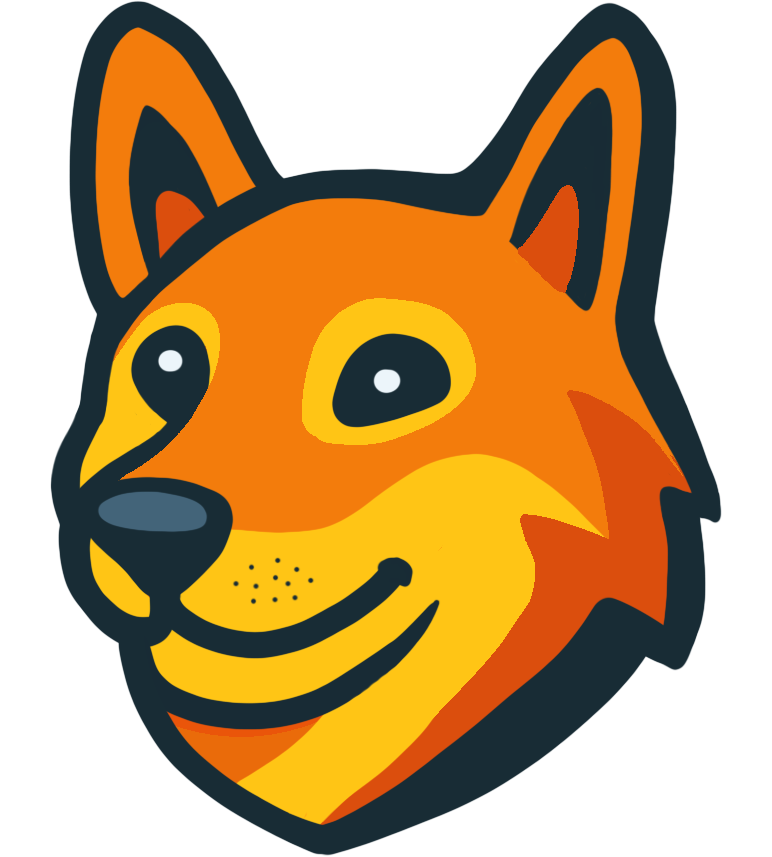

# Perro Game Engine

  

**Perro** is an experimental, open-source game engine written in **Rust**, built as a modern alternative to engines like Unreal, Godot, and Unity. It focuses on **simplicity** of making games without sacrificing **performance**.

## Rust as a Scripting Language

While **Rust** is typically a general-purpose systems language, Perro uses it as a scripting language through a structured authoring model. Scripts are organized into clear sections: a target node type, `#[State]` data, lifecycle entry points (`lifecycle!`), and callable behavior methods (`methods!`).

This structure makes it explicit when state is read or mutated, and how nodes are accessed at runtime.

For more details, see the full documentation: [perroengine.com/docs](https://www.perroengine.com/docs).

## Contributions

Perro is, of course, **open source**, and contributions are always appreciated: issue reports, new features, system optimizations, and other improvements. Everyone is welcome to join the project.

## Support Perro

Donations help fund full-time development, faster features, and better tooling. If you want to support the project:

- [Support Directly](https://perroengine.com/sponsor)
- [Support on Ko-fi](https://ko-fi.com/perroengine)

---

## License

Perro is licensed under the **Apache 2.0 License**. See [LICENSE](LICENSE) for details.

---

